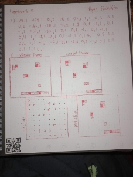

**HOMEWORK SCANNER**

Ryan Piedrahita

**Abstract**

A document scanner is a common image processing problem solved many times in apps and printer scanners, but the focus of these processors is usually to shape the page to be vertical, and to make black printed text clearer. The objective of this project was to create a document scanner suited specifically to written text and drawings, using multiple colors of pens, on a white paper with a background. This was done in C++ using opencv to read the images and perform all the image processing operations. The process was to involve an edge detection algorithm that isolated the pen strokes and to create a mask out of it to reconstitute the color of the stroke from the original image. The result is a very clear and tweakable image that isolates the pen strokes while preserving the color, although only lines are preserved, not solid blocks of color.

**Process**

Initial steps are taken to prepare the image for the laplacian filter which is very sensitive to noise. The first step is to wash out the image by adding gray to the entire image

 

**Original -> Brightened**

And then a Gaussian Blur is applied to the image to smooth out any noise in preparation for the edge detection.

**Brightened -> Blurred**

From here, the image was ready for edge detection. A Laplacian second-order derivative filter was used instead of a first-order filter to prioritize the thin ridges that make up the majority of written and drawn documents.

 

**Blurred -> Filtered**

The image was thresholded to remove some of the noise and very light lines that likely were not drawn by hand.

**Filtered -> Threshold**

This thresholded image could then be used as a mask to isolate and extract the pen strokes from the original image, and then have the masked input overlaid on the inverse of the mask to create the resulting image.

**Masked Input + Inverse Mask -> Result**

**Instructions**

To compile and run the program from the provided files, Visual Studio 2022 with the C++ desktop development module is required. Open the .sln file with Visual Studio. Once open, make sure the Solution Configurations option is set to Release, and then press Ctrl + Shift + B to build the solution. The executable can be found under the /x64/Release/ folder and can be run directly to scan a document using the default settings found to work best. The example jpg image used in this report has been provided, called input.jpg. Type in input.jpg when prompted, then press enter to execute the process with the result being sent to out.jpg in the same folder. Custom settings for the process, specifically the brightness increase, blur radius, and threshold, can be used when executing from the command line in the format of

./HomeworkScannerBuildable input.jpg output.jpg 80 7 140 

80 being the default brightness increase

7 being the default blur radius

140 being the default threshold value
